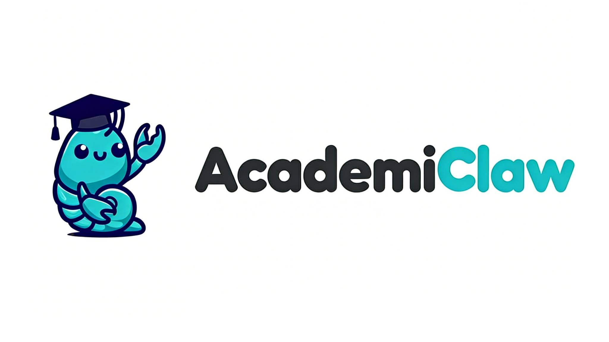

<p align="center">
  
</p>

<p align="center">
  这是一个上过学的龙虾你也可以叫他为AC（~~当然不是毙你文章的AC~~）
</p>

<p align="center">
  <a href="README.md">English</a>&nbsp; • &nbsp;
  <a href="https://github.com/qwibitai/nanoclaw">NanoClaw</a>&nbsp;
</p>

## 功能特性
相较于NanoClaw，我们主要针对国内通讯、记忆系统和学术专项技能进行了修改

- **语义记忆搜索** - SQLite + LanceDB 混合架构，智能上下文检索
- **多渠道支持** - WhatsApp、Telegram、Slack、飞书
- **Agent 群组** - 多 Agent 协作处理复杂任务
- **定时任务** - 自动化研究摘要和周期性作业
- **容器隔离** - 每个群组独立安全沙箱执行
- **学术集成** - 为科研工作流程优化

## 快速开始

```bash
git clone https://github.com//academiclaw.git
cd academiclaw
claude
```
然后运行 `/setup`。Claude Code 会处理一切：依赖安装、身份验证、容器设置、服务配置

### 初始化设置

在 Claude Code CLI 中运行 `/setup` 配置：
- 依赖项和容器
- 消息渠道（WhatsApp、Telegram 等）
- 记忆系统（可选）

### 记忆系统

AcademiClaw 包含可选的语义记忆系统：

| 模式 | 描述 | 费用 |
|------|------|------|
| 关闭 | 仅 SQLite（精确匹配） | 免费 |
| Mock | 测试模式，无需 API | 免费 |
| Jina AI | 高质量嵌入 | 100万/月免费 |
| OpenAI | 官方嵌入 | 按量付费 |

在 `.env` 中设置 `MEMORY_ENABLED=true` 启用。

## 使用方法

使用触发词（默认：`@Andy`）与助手对话：

```
@Andy 总结 arXiv 上最新的语义搜索论文
@Andy 每周一上午 9 点创建我的研究笔记摘要
@Andy 在对话历史中搜索"向量数据库基准测试"
```

## 架构设计

```
渠道 → SQLite + LanceDB → 轮询 → 容器 (Claude Agent) → 响应
```

核心组件：
- `src/index.ts` - 主编排器
- `src/memory/` - 语义搜索系统
- `src/channels/` - 渠道实现
- `src/container-runner.ts` - 容器执行
- `src/task-scheduler.ts` - 定时任务

### 记忆系统

```
      ┌────────────┐
      │   Input    │
      └─────┬──────┘
            │
   ┌────────┴─────────┐
   ▼                  ▼
 SQLite           LanceDB
(源数据库)         (语义索引)
   │                  │
   └────────┬─────────┘
            ▼
        混合检索器
```

## 配置选项

主要环境变量：

```bash
# 记忆系统
MEMORY_ENABLED=false                    # 启用语义搜索
EMBEDDING_API_KEY=                      # Jina AI 或 OpenAI 密钥
EMBEDDING_BASE_URL=https://api.jina.ai/v1
EMBEDDING_MODEL=jina-embeddings-v3

# Claude API
ANTHROPIC_API_KEY=sk-ant-...
CLAUDE_CODE_OAUTH_TOKEN=                # 备选方案

# 助手配置
ASSISTANT_NAME=Andy
ASSISTANT_HAS_OWN_NUMBER=false
```

完整选项见 `.env.example`。

## 系统要求

- macOS 或 Linux
- Node.js 20+
- [Claude Code](https://claude.ai/download)
- [Docker](https://docker.com) 或 [Apple Container](https://github.com/apple/container)

## 开发

```bash
npm run dev          # 热重载运行
npm run build        # 编译 TypeScript
npm test             # 运行测试
```

### 记忆系统测试

```bash
# 单元测试
npm test

# 集成测试
npx tsx scripts/test-memory-integration.ts

# E2E 测试（使用 Mock 嵌入）
MEMORY_ENABLED=true MEMORY_USE_MOCK_EMBEDDINGS=true npx tsx scripts/test-memory-e2e.ts

# Jina AI 测试（需要 API 密钥）
JINA_API_KEY=your-key npx tsx scripts/test-jina-memory.ts
```

## 文档

- [记忆系统架构](docs/MEMORY_ARCHITECTURE.md) - 详细系统设计
- [测试结果](docs/MEMORY_TEST_RESULTS.md) - 测试覆盖
- [需求文档](docs/REQUIREMENTS.md) - 架构决策
- [NanoClaw 规范](docs/SPEC.md) - 基础系统规范

## 故障排除

**记忆系统不工作：**
- 检查 `.env` 中 `MEMORY_ENABLED=true`
- 验证 API 密钥已设置
- 查看日志：`tail -f logs/academiclaw.log`

**容器启动失败：**
- 确保 Docker 运行中：`docker info`
- 检查容器日志：`groups/main/logs/`

**消息无响应：**
- 验证触发模式（默认：`@Andy`）
- 检查 `.env` 中的渠道凭据

## 贡献指南

AcademiClaw 是 [NanoClaw](https://github.com/qwibitai/nanoclaw) 的极简派生版本。贡献应遵循相同原则：

1. **技能优于功能** - 使用 `.claude/skills/` 添加扩展
2. **保持极简** - 不要添加臃肿功能
3. **文档更新** - 更新相关文档

## 许可证

MIT（与 NanoClaw 相同）

## 致谢

基于 [NanoClaw](https://github.com/qwibitai/nanoclaw) by qwibitai。
